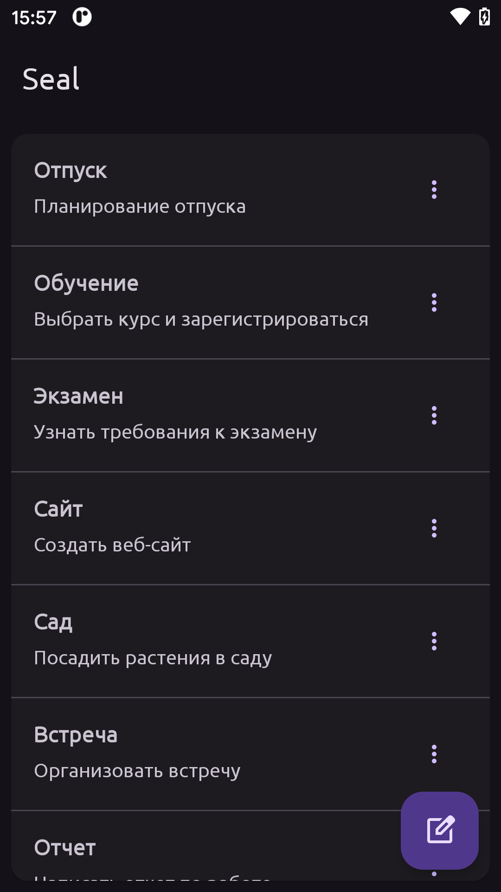
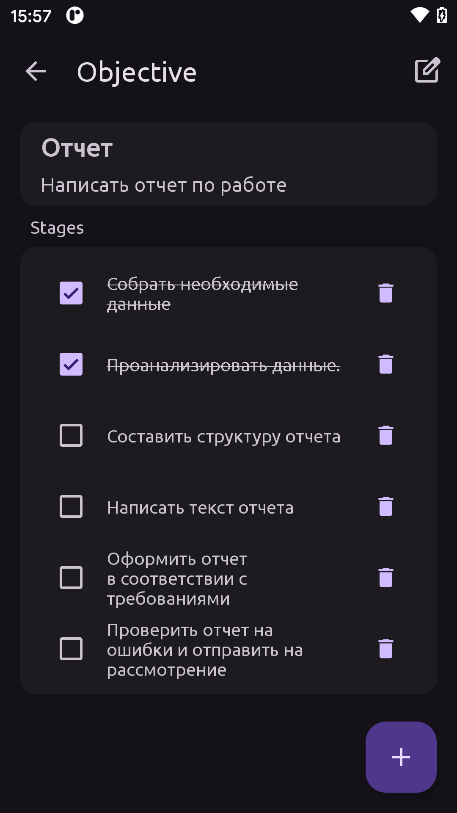
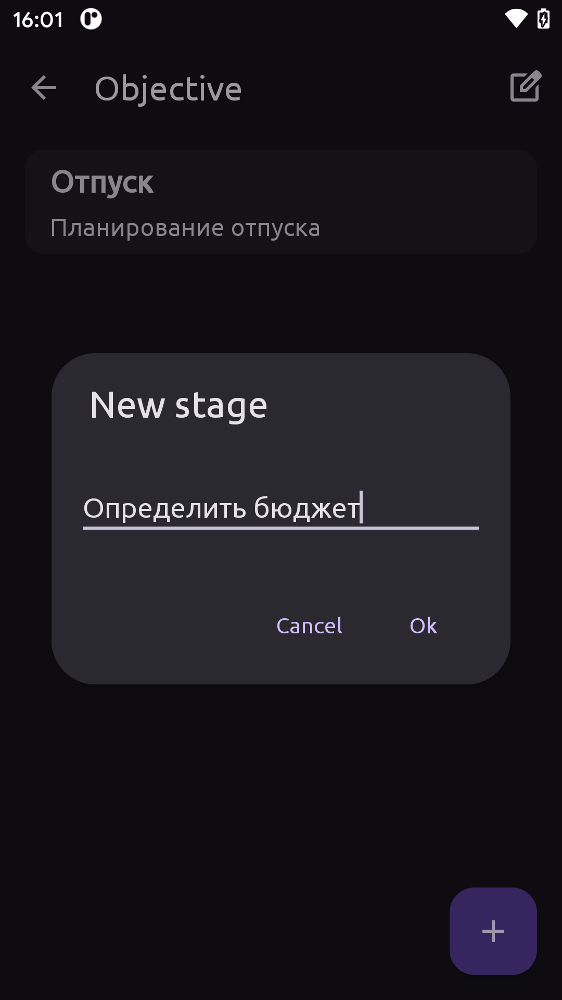

# Мобильное приложение Seal

Seal - это интуитивно понятное приложение для установления целей.

Основные функции:

+ Установление Целей: Создавайте четкие и конкретные цели с помощью простого в использовании интерфейса.
+ Этапы Выполнения: Добавляйте подзадачи и этапы для каждой цели, чтобы сделать процесс достижения более структурированным.

#### Инструменты

+ Android Studio.
+ Kotlin.
+ Navigation component.
+ Room
+ Dagger Hilt.
+ Git + GitHub.

## Скриншоты
  